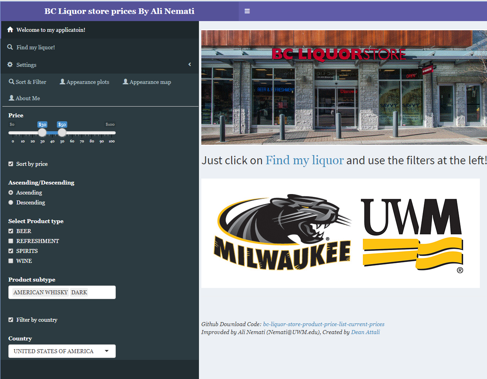
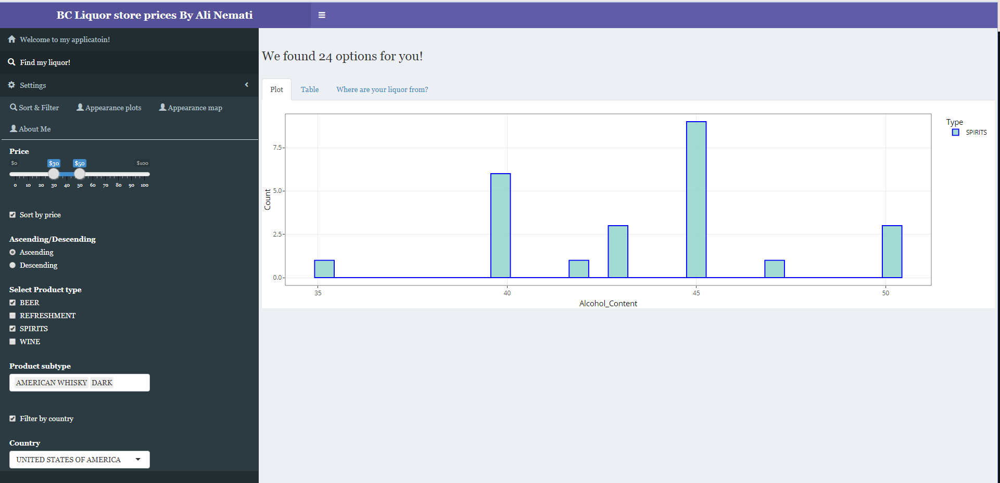
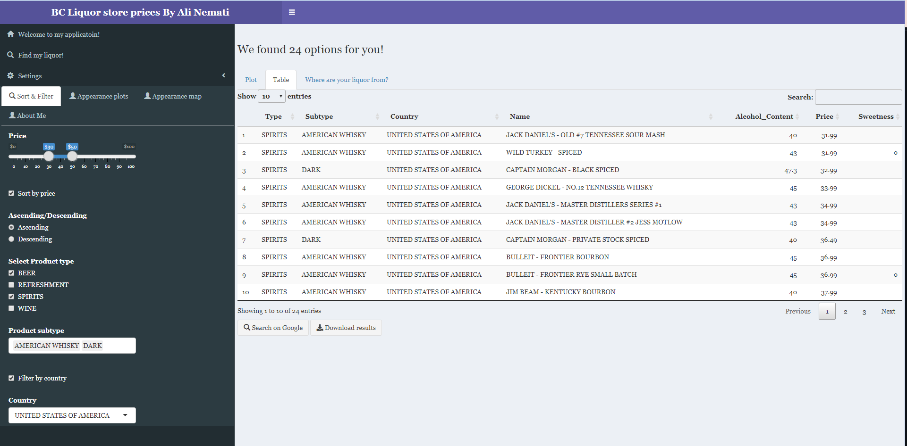
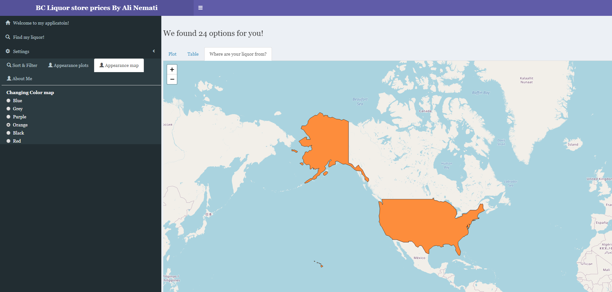
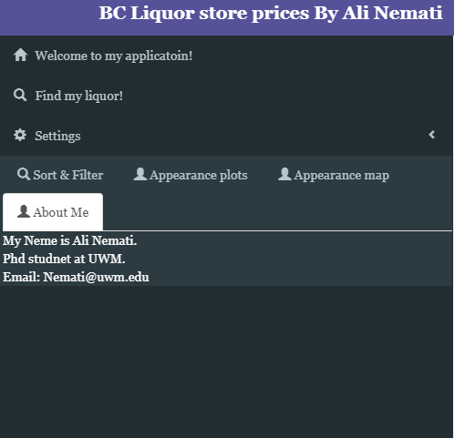

# bc liquor store product price list current-prices

## Email : Nemati@UWM.EDU 

This is the repository for a R shiny app that introduces the bc liquor store product price list current-prices. You can inspect the app on my [Demo Project](https://alinemati.shinyapps.io/bcl_new_update/) or run the app via:

 

